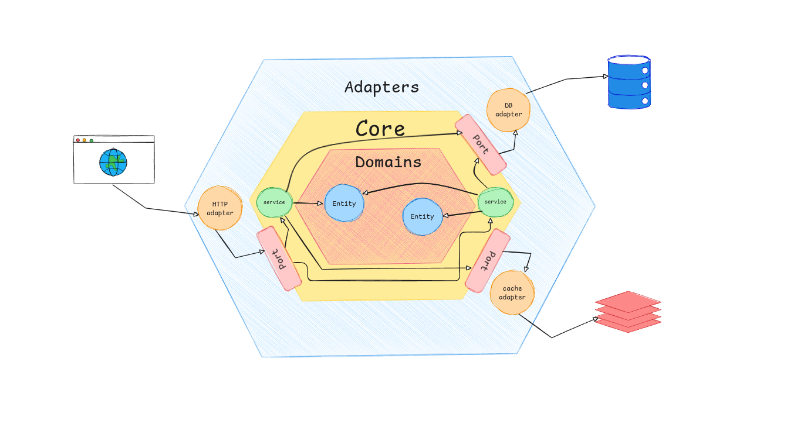

# Estudo de Arquitetura Hexagonal com Go

Este projeto foi desenvolvido como um estudo prático e aprofundado sobre Arquitetura Hexagonal (também conhecida como Ports & Adapters). O objetivo principal foi construir uma aplicação back-end em Go que fosse limpa, manutenível, testável e desacoplada, seguindo os princípios desta arquitetura.

A aplicação consiste em uma API RESTful para gerenciar usuários, autenticação e projetos, com uma integração de IA para geração de conteúdo.

## Arquitetura: Hexagonal (Ports & Adapters)

A Arquitetura Hexagonal foi escolhida para isolar a lógica de negócio principal (o "núcleo" ou "core") das dependências externas, como banco de dados, APIs de terceiros e a própria interface HTTP.

Core (Domínio): Contém a lógica de negócio pura, sem qualquer conhecimento sobre o mundo exterior.

Ports (Portas): São as interfaces definidas pelo core que atuam como contratos. Elas definem o que a aplicação precisa fazer, mas não como.

Adapters (Adaptadores): São as implementações concretas das portas. Eles traduzem a comunicação entre o core e as ferramentas externas.



## Funcionalidades Implementadas

-   Autenticação de Usuários: Cadastro e Login com autenticação via token Paseto (uma alternativa segura ao JWT).
-   CRUD de Projetos: Criação, Leitura, Atualização e Deleção de projetos associados a um usuário.
-   Geração de Conteúdo com IA: Integração com a API da OpenAI para gerar descrições de projetos automaticamente com base em um título.
-   Cache com Redis: Implementação de uma camada de cache para otimizar consultas frequentes.
-   Middleware de Autenticação: Proteção de rotas que exigem um usuário logado.

## Stack utilizada

**Back-end:** Go (v1.24), HTTP: Chi, Redis, PostgreSQL, golang-migrate, air e openAi

## Variáveis de Ambiente

Para rodar esse projeto, você vai precisar adicionar as seguintes variáveis de ambiente no seu .env utilize o .env.example de base

## Rodando localmente

Clone o projeto

```bash
  $ git clone https://github.com/g-villarinho/hexagonal-demo.git
```

Entre no diretório do projeto

```bash
  $ cd hexagonal-demo
```

Use o Makefile para subir todos os contêineres (API, Postgres, Redis, pgAdmin) em modo de desenvolvimento com live-reload.

```bash
  $ make dev
```

Aplique as Migrações do Banco de Dados:

Com o ambiente rodando, abra um novo terminal e execute o seguinte comando para criar as tabelas no banco de dados.

```bash
  $ make migrate-up
```

## Estrutura de Pastas

A estrutura do projeto foi organizada para refletir a Arquitetura Hexagonal:

```bash
├── cmd/                # Pontos de entrada da aplicação (main.go)
├── config/             # Carregamento de configuração (.env)
├── internal/
│   ├── core/           # O Hexágono (Núcleo da Aplicação)
│   │   ├── domain/     # Entidades e regras de negócio puras
│   │   └── port/       # As Interfaces (Portas)
│   │   └── service/    # Implementação da lógica de negócio
│   └── adapter/        # Os Adaptadores
│       ├── cache/      # Adaptador para o Redis
│       ├── handler/    # Adaptador para o HTTP (handlers, DTOs, rotas, middlwares)
│       ├── openai/     # Adaptador para a API da OpenAI
│       ├── repository/ # Adaptador para o PostgreSQL (implementação do repositório)
│       └── token/      # Adaptador para o Paseto
├── Makefile            # Comandos para automação
└── docker-compose.yml  # Orquestração dos contêineres

```

# estrutura de toda aplicação:

```text
├── cmd
│   └── http
│       └── main.go
├── config
│   └── config.go
├── docker-compose.override.yml
├── docker-compose.yml
├── Dockerfile
├── Dockerfile.dev
├── docs
│   └── images
│       └── arquitetura.png
├── go.mod
├── go.sum
├── internal
│   ├── adapter
│   │   ├── cache
│   │   │   └── redis
│   │   │       └── redis_repository.go
│   │   ├── handler
│   │   │   └── http
│   │   │       ├── dto
│   │   │       │   ├── user_request.go
│   │   │       │   └── user_response.go
│   │   │       ├── middlewares
│   │   │       │   └── auth.go
│   │   │       ├── response
│   │   │       │   └── response.go
│   │   │       ├── router.go
│   │   │       └── user_handler.go
│   │   ├── openai
│   │   │   └── generator.go
│   │   ├── repository
│   │   │   └── postgres
│   │   │       ├── migrations
│   │   │       │   ├── 000001_create_users_table.down.sql
│   │   │       │   ├── 000001_create_users_table.up.sql
│   │   │       │   ├── 000002_create_projects_table.down.sql
│   │   │       │   └── 000002_create_projects_table.up.sql
│   │   │       ├── project_repository.go
│   │   │       └── user_repository.go
│   │   └── token
│   │       └── paseto
│   │           └── paseto_maker.go
│   └── core
│       ├── domain
│       │   ├── errors.go
│       │   ├── project.go
│       │   └── user.go
│       ├── port
│       │   ├── ai.go
│       │   ├── cache.go
│       │   ├── project.go
│       │   ├── token.go
│       │   └── user.go
│       └── service
│           ├── projct_service.go
│           └── user_service.go
├── Makefile
└── README.md
```
