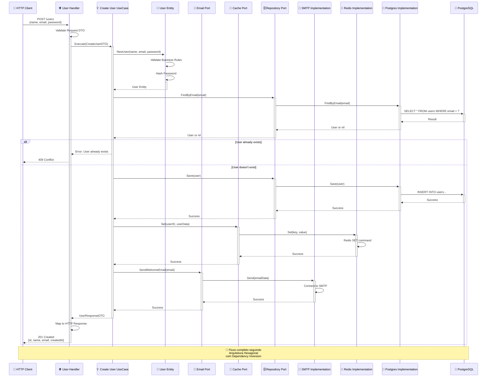
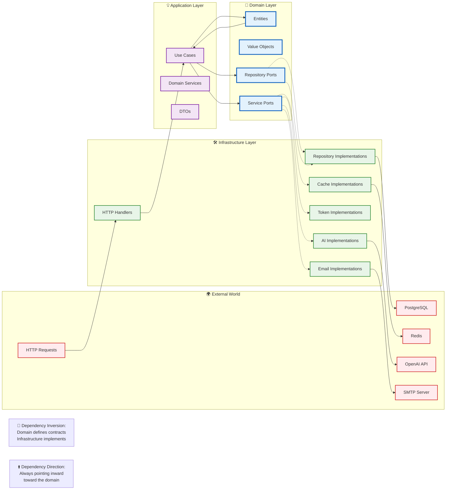

# Estudo de Arquitetura Hexagonal com Go

Este projeto foi desenvolvido como um estudo prático e aprofundado sobre Arquitetura Hexagonal (também conhecida como Ports & Adapters). O objetivo principal foi construir uma aplicação back-end em Go que fosse limpa, manutenível, testável e desacoplada, seguindo os princípios desta arquitetura.

A aplicação consiste em uma API RESTful para gerenciar usuários, autenticação e projetos, com uma integração de IA para geração de conteúdo.

## Arquitetura: Hexagonal (Ports & Adapters)

A Arquitetura Hexagonal foi escolhida para isolar a lógica de negócio principal (o "núcleo" ou "core") das dependências externas, como banco de dados, APIs de terceiros e a própria interface HTTP.

Core (Domínio): Contém a lógica de negócio pura, sem qualquer conhecimento sobre o mundo exterior.

Ports (Portas): São as interfaces definidas pelo core que atuam como contratos. Elas definem o que a aplicação precisa fazer, mas não como.

Adapters (Adaptadores): São as implementações concretas das portas. Eles traduzem a comunicação entre o core e as ferramentas externas.


## Funcionalidades Implementadas

-   Autenticação de Usuários: Cadastro e Login com autenticação via token Paseto (uma alternativa segura ao JWT).
-   CRUD de Projetos: Criação, Leitura, Atualização e Deleção de projetos associados a um usuário.
-   Geração de Conteúdo com IA: Integração com a API da OpenAI para gerar descrições de projetos automaticamente com base em um título.
-   Cache com Redis: Implementação de uma camada de cache para otimizar consultas frequentes.
-   Middleware de Autenticação: Proteção de rotas que exigem um usuário logado.

## Stack utilizada

**Back-end:** Go (v1.24), HTTP: Chi, Redis, PostgreSQL, golang-migrate, air e openAi

## Variáveis de Ambiente

Para rodar esse projeto, você vai precisar adicionar as seguintes variáveis de ambiente no seu .env utilize o .env.example de base

## Rodando localmente

Clone o projeto

```bash
  $ git clone https://github.com/g-villarinho/hexagonal-demo.git
```

Entre no diretório do projeto

```bash
  $ cd hexagonal-demo
```

Use o Makefile para subir todos os contêineres (API, Postgres, Redis, pgAdmin) em modo de desenvolvimento com live-reload.

```bash
  $ make dev
```

Aplique as Migrações do Banco de Dados:

Com o ambiente rodando, abra um novo terminal e execute o seguinte comando para criar as tabelas no banco de dados.

```bash
  $ make migrate-up
```

## Estrutura de Pastas

A estrutura do projeto foi organizada para refletir a Arquitetura Hexagonal:

```bash
├── cmd/                # Pontos de entrada da aplicação (main.go)
├── config/             # Carregamento de configuração (.env)
├── internal/
│   ├── core/           # O Hexágono (Núcleo da Aplicação)
│   │   ├── domain/     # Entidades e regras de negócio puras
│   │   └── port/       # As Interfaces (Portas)
│   │   └── service/    # Implementação da lógica de negócio
│   └── adapter/        # Os Adaptadores
│       ├── cache/      # Adaptador para o Redis
│       ├── handler/    # Adaptador para o HTTP (handlers, DTOs, rotas, middlwares)
│       ├── openai/     # Adaptador para a API da OpenAI
│       ├── repository/ # Adaptador para o PostgreSQL (implementação do repositório)
│       └── token/      # Adaptador para o Paseto
├── Makefile            # Comandos para automação
└── docker-compose.yml  # Orquestração dos contêineres

```

# estrutura de toda aplicação atual:

```text
├── cmd
│   └── http
│       └── main.go
├── config
│   └── config.go
├── docker-compose.override.yml
├── docker-compose.yml
├── Dockerfile
├── Dockerfile.dev
├── docs
│   └── images
│       └── arquitetura.png
├── go.mod
├── go.sum
├── internal
│   ├── adapter
│   │   ├── cache
│   │   │   └── redis
│   │   │       └── redis_repository.go
│   │   ├── handler
│   │   │   └── http
│   │   │       ├── dto
│   │   │       │   ├── user_request.go
│   │   │       │   └── user_response.go
│   │   │       ├── middlewares
│   │   │       │   └── auth.go
│   │   │       ├── response
│   │   │       │   └── response.go
│   │   │       ├── router.go
│   │   │       └── user_handler.go
│   │   ├── openai
│   │   │   └── generator.go
│   │   ├── repository
│   │   │   └── postgres
│   │   │       ├── migrations
│   │   │       │   ├── 000001_create_users_table.down.sql
│   │   │       │   ├── 000001_create_users_table.up.sql
│   │   │       │   ├── 000002_create_projects_table.down.sql
│   │   │       │   └── 000002_create_projects_table.up.sql
│   │   │       ├── project_repository.go
│   │   │       └── user_repository.go
│   │   └── token
│   │       └── paseto
│   │           └── paseto_maker.go
│   └── core
│       ├── domain
│       │   ├── errors.go
│       │   ├── project.go
│       │   └── user.go
│       ├── port
│       │   ├── ai.go
│       │   ├── cache.go
│       │   ├── project.go
│       │   ├── token.go
│       │   └── user.go
│       └── service
│           ├── projct_service.go
│           └── user_service.go
├── Makefile
└── README.md
```

# Adaptação da estrutura modular Go - arquitetura hexagonal modularizada

# Estrutura Go Hexagonal Melhorada

## 🎯 Estrutura Recomendada (Modular por Feature + Clean Architecture)

```text
├── cmd/
│   └── api/
│       └── main.go                     # Entry point da aplicação
│
├── internal/
│   ├── user/                           # 🧍 Módulo User (Bounded Context)
│   │   ├── domain/
│   │   │   ├── entity/
│   │   │   │   └── user.go             # Entidade User pura
│   │   │   ├── value_object/
│   │   │   │   ├── email.go            # Value Objects
│   │   │   │   └── password.go
│   │   │   └── repository/
│   │   │       └── user_repository.go  # Interface do repositório
│   │   │
│   │   ├── application/
│   │   │   ├── usecase/
│   │   │   │   ├── create_user.go      # Casos de uso específicos
│   │   │   │   ├── authenticate.go
│   │   │   │   └── get_user.go
│   │   │   ├── service/
│   │   │   │   └── user_service.go     # Serviço de domínio
│   │   │   └── dto/
│   │   │       ├── create_user_dto.go
│   │   │       └── user_response_dto.go
│   │   │
│   │   └── infrastructure/
│   │       ├── http/
│   │       │   ├── handler/
│   │       │   │   └── user_handler.go
│   │       │   ├── middleware/
│   │       │   │   └── auth_middleware.go
│   │       │   └── routes/
│   │       │       └── user_routes.go
│   │       ├── persistence/
│   │       │   ├── postgres/
│   │       │   │   ├── user_repository.go
│   │       │   │   └── migrations/
│   │       │   │       └── 001_create_users.sql
│   │       │   └── model/
│   │       │       └── user_model.go   # Modelo de persistência
│   │       └── mapper/
│   │           └── user_mapper.go      # Conversão entre camadas
│   │
│   ├── project/                        # 📁 Módulo Project (Bounded Context)
│   │   ├── domain/
│   │   │   ├── entity/
│   │   │   │   └── project.go
│   │   │   ├── value_object/
│   │   │   │   └── project_status.go
│   │   │   └── repository/
│   │   │       └── project_repository.go
│   │   │
│   │   ├── application/
│   │   │   ├── usecase/
│   │   │   │   ├── create_project.go
│   │   │   │   ├── generate_content.go  # Integração com AI
│   │   │   │   └── list_projects.go
│   │   │   ├── service/
│   │   │   │   └── project_service.go
│   │   │   └── dto/
│   │   │       ├── create_project_dto.go
│   │   │       └── project_response_dto.go
│   │   │
│   │   └── infrastructure/
│   │       ├── http/
│   │       │   ├── handler/
│   │       │   │   └── project_handler.go
│   │       │   └── routes/
│   │       │       └── project_routes.go
│   │       ├── persistence/
│   │       │   ├── postgres/
│   │       │   │   ├── project_repository.go
│   │       │   │   └── migrations/
│   │       │   │       └── 002_create_projects.sql
│   │       │   └── model/
│   │       │       └── project_model.go
│   │       └── mapper/
│   │           └── project_mapper.go
│   │
│   └── shared/                         # 🔧 Infraestrutura Compartilhada
│       ├── domain/
│       │   ├── error/
│       │   │   ├── domain_error.go     # Erros de domínio base
│       │   │   └── error_types.go
│       │   └── event/
│       │       ├── domain_event.go     # Eventos de domínio
│       │       └── event_dispatcher.go
│       │
│       ├── application/
│       │   ├── port/
│       │   │   ├── cache_port.go       # Interfaces para infraestrutura
│       │   │   ├── email_port.go
│       │   │   ├── token_port.go
│       │   │   └── ai_port.go
│       │   └── service/
│       │       └── transaction_service.go # Gerenciamento de transações
│       │
│       └── infrastructure/
│           ├── cache/
│           │   ├── redis/
│           │   │   ├── redis_client.go
│           │   │   └── redis_cache.go  # Implementa cache_port
│           │   └── memory/
│           │       └── memory_cache.go # Cache em memória para testes
│           │
│           ├── token/
│           │   ├── paseto/
│           │   │   └── paseto_maker.go # Implementa token_port
│           │   └── jwt/
│           │       └── jwt_maker.go    # Alternativa JWT
│           │
│           ├── email/
│           │   ├── smtp/
│           │   │   └── smtp_sender.go  # Implementa email_port
│           │   └── mock/
│           │       └── mock_sender.go  # Mock para testes
│           │
│           ├── ai/
│           │   ├── openai/
│           │   │   └── openai_client.go # Implementa ai_port
│           │   └── mock/
│           │       └── mock_ai.go      # Mock para testes
│           │
│           ├── encoder/
│           │   └── bcrypt/
│           │       └── password_encoder.go
│           │
│           ├── database/
│           │   ├── postgres/
│           │   │   ├── connection.go
│           │   │   └── transaction.go
│           │   └── migration/
│           │       └── migrator.go
│           │
│           └── http/
│               ├── server/
│               │   └── server.go
│               ├── middleware/
│               │   ├── cors.go
│               │   ├── logger.go
│               │   └── recovery.go
│               └── response/
│                   ├── response.go
│                   └── error_response.go
│
├── pkg/                               # 📦 Pacotes públicos (podem ser importados externamente)
│   ├── config/
│   │   ├── config.go
│   │   └── validator.go
│   ├── logger/
│   │   └── logger.go
│   └── validator/
│       └── validator.go
│
├── test/                             # 🧪 Testes de integração e E2E
│   ├── integration/
│   │   ├── user_test.go
│   │   └── project_test.go
│   ├── e2e/
│   │   └── api_test.go
│   └── fixtures/
│       └── test_data.go
│
├── scripts/                          # 📜 Scripts de automação
│   ├── migrate.sh
│   └── seed.sh
│
├── deployments/                      # 🚀 Configurações de deploy
│   ├── docker/
│   │   ├── Dockerfile
│   │   └── docker-compose.yml
│   └── k8s/
│       └── deployment.yml
│
├── docs/                            # 📚 Documentação
│   ├── architecture/
│   │   └── hexagonal.md
│   └── api/
│       └── swagger.yml
│
├── go.mod
├── go.sum
├── Makefile
└── README.md
```

## 🏗️ Princípios Aplicados

### 1. **Separation of Concerns**

-   **Domain**: Lógica de negócio pura
-   **Application**: Casos de uso e orquestração
-   **Infrastructure**: Detalhes técnicos e implementações

### 2. **Dependency Inversion Principle**

```go
// ✅ Correto: Domínio define a interface
// internal/user/domain/repository/user_repository.go
type UserRepository interface {
    Save(user *entity.User) error
    FindByEmail(email string) (*entity.User, error)
}

// ✅ Infraestrutura implementa
// internal/user/infrastructure/persistence/postgres/user_repository.go
type postgresUserRepository struct {
    db *sql.DB
}

func (r *postgresUserRepository) Save(user *entity.User) error {
    // implementação específica do PostgreSQL
}
```

### 3. **Single Responsibility Principle**

```go
// ✅ Um caso de uso por arquivo
// internal/user/application/usecase/create_user.go
type CreateUserUseCase struct {
    userRepo     domain.UserRepository
    emailService shared.EmailPort
    encoder      shared.PasswordEncoder
}

func (uc *CreateUserUseCase) Execute(dto CreateUserDTO) error {
    // Lógica específica para criação de usuário
}
```

### 4. **Interface Segregation**

```go
// ✅ Interfaces pequenas e específicas
type TokenMaker interface {
    CreateToken(userID string, duration time.Duration) (string, error)
}

type TokenVerifier interface {
    VerifyToken(token string) (*Payload, error)
}

// Em vez de uma interface grande com todos os métodos
```

### 5. **Open/Closed Principle**

```go
// ✅ Facilita extensão sem modificação
// Pode adicionar JWT, PASETO, etc. sem alterar código existente
type TokenPort interface {
    Generate(payload TokenPayload) (string, error)
    Verify(token string) (*TokenPayload, error)
}
```

## 🔧 Melhorias Implementadas

### **1. Modularização por Bounded Context**

-   Separação clara entre `user` e `project`
-   Cada módulo tem sua própria estrutura hexagonal
-   Reduz acoplamento entre features

### **2. Camada de Domínio Rica**

-   **Entities**: Lógica de negócio
-   **Value Objects**: Conceitos imutáveis
-   **Domain Services**: Lógica que não pertence a uma entidade específica

### **3. Application Layer Bem Definida**

-   **Use Cases**: Um por operação
-   **DTOs**: Contratos de entrada/saída
-   **Ports**: Interfaces para infraestrutura

### **4. Infrastructure Plugável**

-   Implementações podem ser trocadas facilmente
-   Mocks para testes
-   Configuração via injeção de dependência

### **5. Shared Kernel Inteligente**

-   Apenas código realmente compartilhado
-   Interfaces (ports) em vez de implementações
-   Evita acoplamento desnecessário

### **6. Testabilidade**

-   Mocks para todas as dependências externas
-   Testes isolados por camada
-   Testes de integração separados

## 🚀 Vantagens desta Estrutura

1. **Manutenibilidade**: Código organizado e fácil de encontrar
2. **Testabilidade**: Dependências injetáveis e mockáveis
3. **Flexibilidade**: Fácil troca de implementações
4. **Escalabilidade**: Novos módulos seguem o mesmo padrão
5. **Separação de Responsabilidades**: Cada camada tem seu propósito
6. **Independência de Framework**: Domínio isolado de detalhes técnicos

## 📝 Exemplo de Injeção de Dependência

```go
// cmd/api/main.go
func main() {
    // Configuração
    cfg := config.Load()

    // Infraestrutura compartilhada
    db := postgres.NewConnection(cfg.Database)
    cache := redis.NewCache(cfg.Redis)
    tokenMaker := paseto.NewMaker(cfg.TokenSecret)

    // User Module
    userRepo := postgres.NewUserRepository(db)
    createUserUC := usecase.NewCreateUser(userRepo, cache, tokenMaker)
    userHandler := handler.NewUserHandler(createUserUC)

    // Setup server
    server := server.New(cfg.Port)
    server.RegisterUserRoutes(userHandler)
    server.Start()
}
```

## 📝 Diagrama Arquitetural

```mermaid
graph TB
    %% Estilo dos nós
    classDef domainClass fill:#e1f5fe,stroke:#01579b,stroke-width:3px,color:#000
    classDef applicationClass fill:#f3e5f5,stroke:#4a148c,stroke-width:2px,color:#000
    classDef infrastructureClass fill:#e8f5e8,stroke:#1b5e20,stroke-width:2px,color:#000
    classDef sharedClass fill:#fff3e0,stroke:#e65100,stroke-width:2px,color:#000
    classDef externalClass fill:#ffebee,stroke:#b71c1c,stroke-width:2px,color:#000

    %% External Systems
    subgraph "🌐 External Systems"
        HTTP[HTTP Clients]
        DB[(PostgreSQL)]
        REDIS[(Redis)]
        OPENAI[OpenAI API]
        SMTP[SMTP Server]
    end

    %% Infrastructure Layer
    subgraph "🛠️ Infrastructure Layer"
        subgraph "HTTP Adapters"
            HANDLER[User/Project Handlers]
            MIDDLEWARE[Auth Middleware]
            ROUTES[Route Definitions]
        end

        subgraph "Persistence Adapters"
            REPO_IMPL[Repository Implementations]
            MODELS[Database Models]
            MIGRATIONS[SQL Migrations]
        end

        subgraph "External Service Adapters"
            CACHE_IMPL[Redis Cache Implementation]
            TOKEN_IMPL[PASETO Token Implementation]
            EMAIL_IMPL[SMTP Email Implementation]
            AI_IMPL[OpenAI Implementation]
        end
    end

    %% Application Layer
    subgraph "💡 Application Layer"
        subgraph "User Module"
            subgraph "User Use Cases"
                CREATE_USER[Create User]
                AUTH_USER[Authenticate User]
                GET_USER[Get User]
            end

            subgraph "User Services"
                USER_SERVICE[User Domain Service]
            end

            subgraph "User DTOs"
                USER_DTO[User Request/Response DTOs]
            end
        end

        subgraph "Project Module"
            subgraph "Project Use Cases"
                CREATE_PROJECT[Create Project]
                GENERATE_CONTENT[Generate AI Content]
                LIST_PROJECTS[List Projects]
            end

            subgraph "Project Services"
                PROJECT_SERVICE[Project Domain Service]
            end

            subgraph "Project DTOs"
                PROJECT_DTO[Project Request/Response DTOs]
            end
        end
    end

    %% Domain Layer
    subgraph "🧠 Domain Layer (Core)"
        subgraph "User Domain"
            USER_ENTITY[User Entity]
            USER_VO[Email/Password VOs]
            USER_REPO_PORT[User Repository Port]
        end

        subgraph "Project Domain"
            PROJECT_ENTITY[Project Entity]
            PROJECT_VO[Project Status VO]
            PROJECT_REPO_PORT[Project Repository Port]
        end

        subgraph "Domain Events"
            DOMAIN_EVENTS[Domain Events]
            EVENT_DISPATCHER[Event Dispatcher]
        end
    end

    %% Shared Kernel
    subgraph "🔧 Shared Kernel"
        subgraph "Shared Ports"
            CACHE_PORT[Cache Port]
            TOKEN_PORT[Token Port]
            EMAIL_PORT[Email Port]
            AI_PORT[AI Port]
        end

        subgraph "Shared Domain"
            DOMAIN_ERRORS[Domain Errors]
            BASE_ENTITY[Base Entity]
        end

        subgraph "Transaction Management"
            TRANSACTION[Transaction Service]
        end
    end

    %% Entry Point
    MAIN[🚀 Main Application<br/>cmd/api/main.go]

    %% Connections - Entry Point
    MAIN --> HANDLER
    MAIN --> MIDDLEWARE

    %% Connections - HTTP to Application
    HTTP --> HANDLER
    HANDLER --> CREATE_USER
    HANDLER --> AUTH_USER
    HANDLER --> GET_USER
    HANDLER --> CREATE_PROJECT
    HANDLER --> GENERATE_CONTENT
    HANDLER --> LIST_PROJECTS

    %% Connections - Use Cases to Domain
    CREATE_USER --> USER_ENTITY
    CREATE_USER --> USER_REPO_PORT
    AUTH_USER --> USER_ENTITY
    AUTH_USER --> USER_REPO_PORT
    GET_USER --> USER_REPO_PORT

    CREATE_PROJECT --> PROJECT_ENTITY
    CREATE_PROJECT --> PROJECT_REPO_PORT
    GENERATE_CONTENT --> PROJECT_ENTITY
    GENERATE_CONTENT --> AI_PORT
    LIST_PROJECTS --> PROJECT_REPO_PORT

    %% Connections - Use Cases to Shared Services
    CREATE_USER --> EMAIL_PORT
    CREATE_USER --> CACHE_PORT
    AUTH_USER --> TOKEN_PORT
    CREATE_PROJECT --> CACHE_PORT

    %% Connections - Ports to Implementations
    USER_REPO_PORT -.-> REPO_IMPL
    PROJECT_REPO_PORT -.-> REPO_IMPL
    CACHE_PORT -.-> CACHE_IMPL
    TOKEN_PORT -.-> TOKEN_IMPL
    EMAIL_PORT -.-> EMAIL_IMPL
    AI_PORT -.-> AI_IMPL

    %% Connections - Infrastructure to External
    REPO_IMPL --> DB
    CACHE_IMPL --> REDIS
    EMAIL_IMPL --> SMTP
    AI_IMPL --> OPENAI

    %% Connections - Domain Events
    USER_ENTITY --> DOMAIN_EVENTS
    PROJECT_ENTITY --> DOMAIN_EVENTS
    DOMAIN_EVENTS --> EVENT_DISPATCHER

    %% Apply styles
    class USER_ENTITY,PROJECT_ENTITY,USER_VO,PROJECT_VO,DOMAIN_EVENTS,DOMAIN_ERRORS,BASE_ENTITY domainClass
    class CREATE_USER,AUTH_USER,GET_USER,CREATE_PROJECT,GENERATE_CONTENT,LIST_PROJECTS,USER_SERVICE,PROJECT_SERVICE,USER_DTO,PROJECT_DTO applicationClass
    class HANDLER,MIDDLEWARE,ROUTES,REPO_IMPL,MODELS,MIGRATIONS,CACHE_IMPL,TOKEN_IMPL,EMAIL_IMPL,AI_IMPL infrastructureClass
    class CACHE_PORT,TOKEN_PORT,EMAIL_PORT,AI_PORT,USER_REPO_PORT,PROJECT_REPO_PORT,TRANSACTION sharedClass
    class HTTP,DB,REDIS,OPENAI,SMTP externalClass
```



## 📝 Diagrama de Sequencia



## 📝 Diagrama de dependências



## 📝 Diagrama modular - Bounded Contexts

```mermaid
graph TB
    %% Styling
    classDef userModule fill:#e8eaf6,stroke:#3f51b5,stroke-width:2px
    classDef projectModule fill:#f1f8e9,stroke:#689f38,stroke-width:2px
    classDef sharedModule fill:#fff3e0,stroke:#ff9800,stroke-width:2px
    classDef entryPoint fill:#ffebee,stroke:#f44336,stroke-width:3px

    %% Entry Point
    subgraph "🚀 Application Entry"
        MAIN["main.go<br/>• DI Container<br/>• Server Setup<br/>• Module Wiring"]
    end

    %% User Module (Bounded Context)
    subgraph "👤 User Module"
        subgraph "User Domain"
            U_ENTITY["User Entity<br/>• Business Rules<br/>• Validation<br/>• State Management"]
            U_VO["Value Objects<br/>• Email<br/>• Password<br/>• UserID"]
            U_REPO_PORT["Repository Port<br/>• Save()<br/>• FindByEmail()<br/>• FindByID()"]
        end

        subgraph "User Application"
            U_CREATE["Create User UC<br/>• Validation<br/>• Password Hashing<br/>• Email Sending"]
            U_AUTH["Authenticate UC<br/>• Credential Check<br/>• Token Generation<br/>• Cache Update"]
            U_GET["Get User UC<br/>• Cache Lookup<br/>• DB Fallback<br/>• Response Mapping"]
        end

        subgraph "User Infrastructure"
            U_HANDLER["HTTP Handler<br/>• Request Parsing<br/>• Response Formatting<br/>• Error Handling"]
            U_REPO_IMPL["Postgres Repo<br/>• SQL Queries<br/>• Data Mapping<br/>• Transaction Mgmt"]
            U_ROUTES["Routes<br/>• POST /users<br/>• POST /auth<br/>• GET /users/:id"]
        end
    end

    %% Project Module (Bounded Context)
    subgraph "📁 Project Module"
        subgraph "Project Domain"
            P_ENTITY["Project Entity<br/>• Content Rules<br/>• Status Management<br/>• User Association"]
            P_VO["Value Objects<br/>• ProjectStatus<br/>• Content<br/>• ProjectID"]
            P_REPO_PORT["Repository Port<br/>• Save()<br/>• FindByUserID()<br/>• FindByID()"]
        end

        subgraph "Project Application"
            P_CREATE["Create Project UC<br/>• User Validation<br/>• Content Generation<br/>• Cache Update"]
            P_GENERATE["Generate Content UC<br/>• AI Integration<br/>• Content Processing<br/>• Status Update"]
            P_LIST["List Projects UC<br/>• Pagination<br/>• Filtering<br/>• Permission Check"]
        end

        subgraph "Project Infrastructure"
            P_HANDLER["HTTP Handler<br/>• Request Validation<br/>• Response Mapping<br/>• Error Handling"]
            P_REPO_IMPL["Postgres Repo<br/>• Complex Queries<br/>• Joins with Users<br/>• Bulk Operations"]
            P_ROUTES["Routes<br/>• POST /projects<br/>• GET /projects<br/>• POST /generate"]
        end
    end

    %% Shared Kernel
    subgraph "🔧 Shared Infrastructure"
        subgraph "Shared Ports"
            S_CACHE_PORT["Cache Port<br/>• Get()<br/>• Set()<br/>• Delete()"]
            S_TOKEN_PORT["Token Port<br/>• Generate()<br/>• Verify()<br/>• Refresh()"]
            S_EMAIL_PORT["Email Port<br/>• Send()<br/>• SendTemplate()<br/>• SendBulk()"]
            S_AI_PORT["AI Port<br/>• GenerateText()<br/>• GenerateImage()<br/>• Analyze()"]
        end

        subgraph "Shared Implementations"
            S_REDIS["Redis Cache<br/>• Connection Pool<br/>• Serialization<br/>• TTL Management"]
            S_PASETO["PASETO Token<br/>• Secure Generation<br/>• Payload Handling<br/>• Expiration"]
            S_SMTP["SMTP Email<br/>• Template Engine<br/>• Queue Management<br/>• Retry Logic"]
            S_OPENAI["OpenAI Client<br/>• API Integration<br/>• Rate Limiting<br/>• Error Handling"]
        end

        subgraph "Shared Domain"
            S_ERRORS["Domain Errors<br/>• Error Types<br/>• Error Codes<br/>• Stack Traces"]
            S_EVENTS["Domain Events<br/>• Event Base<br/>• Event Bus<br/>• Handlers"]
            S_TRANSACTION["Transaction Mgmt<br/>• Unit of Work<br/>• Rollback<br/>• Isolation"]
        end
    end

    %% External Systems
    subgraph "🌐 External Systems"
        EXT_PG[(PostgreSQL<br/>Users & Projects)]
        EXT_REDIS[(Redis<br/>Cache & Sessions)]
        EXT_OPENAI[OpenAI API<br/>Content Generation]
        EXT_SMTP[SMTP Server<br/>Email Delivery]
    end

    %% Main connections
    MAIN --> U_HANDLER
    MAIN --> P_HANDLER
    MAIN --> S_REDIS
    MAIN --> S_PASETO
    MAIN --> S_SMTP
    MAIN --> S_OPENAI

    %% User Module Flow
    U_HANDLER --> U_CREATE
    U_HANDLER --> U_AUTH
    U_HANDLER --> U_GET

    U_CREATE --> U_ENTITY
    U_CREATE --> U_REPO_PORT
    U_CREATE --> S_EMAIL_PORT
    U_CREATE --> S_CACHE_PORT

    U_AUTH --> U_ENTITY
    U_AUTH --> U_REPO_PORT
    U_AUTH --> S_TOKEN_PORT
    U_AUTH --> S_CACHE_PORT

    %% Project Module Flow
    P_HANDLER --> P_CREATE
    P_HANDLER --> P_GENERATE
    P_HANDLER --> P_LIST

    P_CREATE --> P_ENTITY
    P_CREATE --> P_REPO_PORT
    P_CREATE --> S_CACHE_PORT

    P_GENERATE --> P_ENTITY
    P_GENERATE --> S_AI_PORT
    P_GENERATE --> P_REPO_PORT

    %% Port to Implementation connections
    U_REPO_PORT -.-> U_REPO_IMPL
    P_REPO_PORT -.-> P_REPO_IMPL
    S_CACHE_PORT -.-> S_REDIS
    S_TOKEN_PORT -.-> S_PASETO
    S_EMAIL_PORT -.-> S_SMTP
    S_AI_PORT -.-> S_OPENAI

    %% External connections
    U_REPO_IMPL --> EXT_PG
    P_REPO_IMPL --> EXT_PG
    S_REDIS --> EXT_REDIS
    S_SMTP --> EXT_SMTP
    S_OPENAI --> EXT_OPENAI

    %% Domain Events
    U_ENTITY --> S_EVENTS
    P_ENTITY --> S_EVENTS

    %% Apply styles
    class U_ENTITY,U_VO,U_REPO_PORT,U_CREATE,U_AUTH,U_GET,U_HANDLER,U_REPO_IMPL,U_ROUTES userModule
    class P_ENTITY,P_VO,P_REPO_PORT,P_CREATE,P_GENERATE,P_LIST,P_HANDLER,P_REPO_IMPL,P_ROUTES projectModule
    class S_CACHE_PORT,S_TOKEN_PORT,S_EMAIL_PORT,S_AI_PORT,S_REDIS,S_PASETO,S_SMTP,S_OPENAI,S_ERRORS,S_EVENTS,S_TRANSACTION sharedModule
    class MAIN entryPoint
```


